## How to upload an application##

- Go to [opentosca2](localhost:8088/#/applications)
- Click on **Upload New Application**

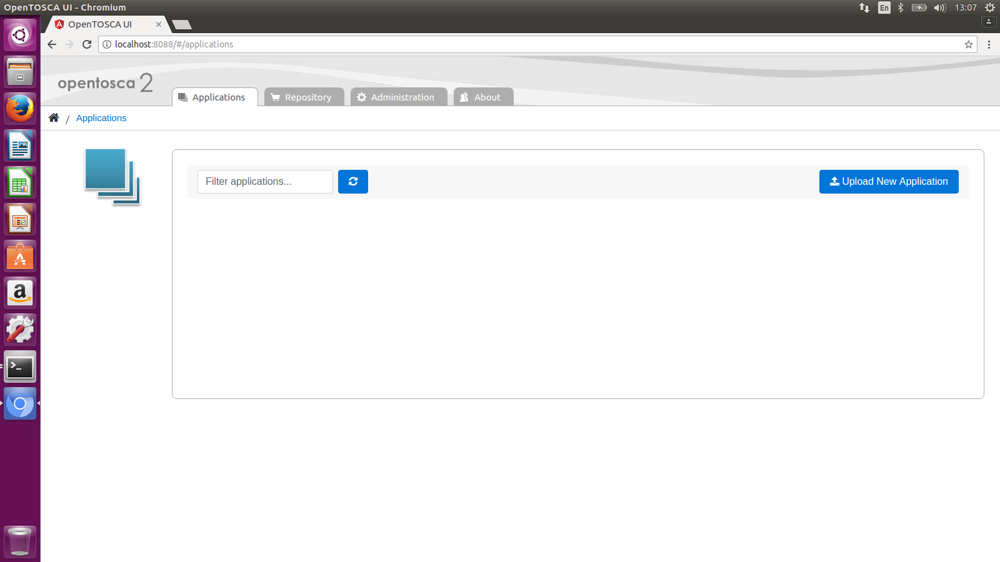

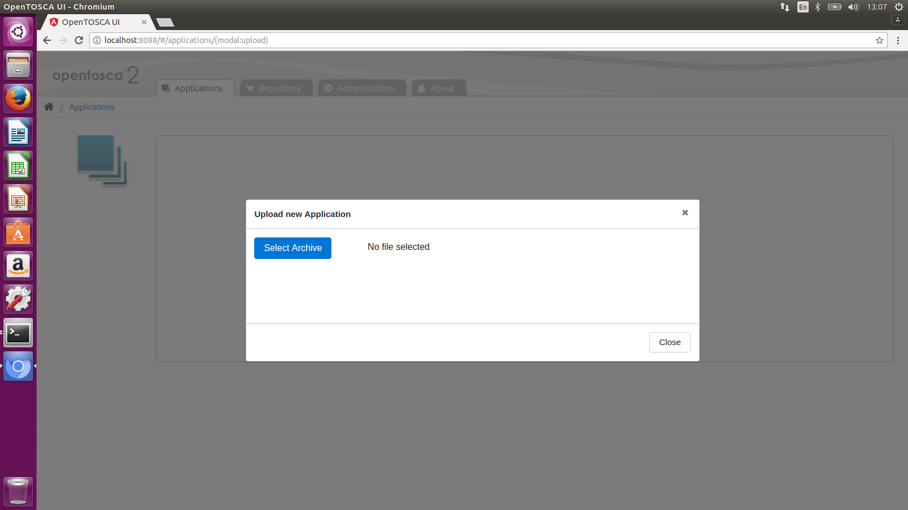

- Select **MyTinyToDo** Application

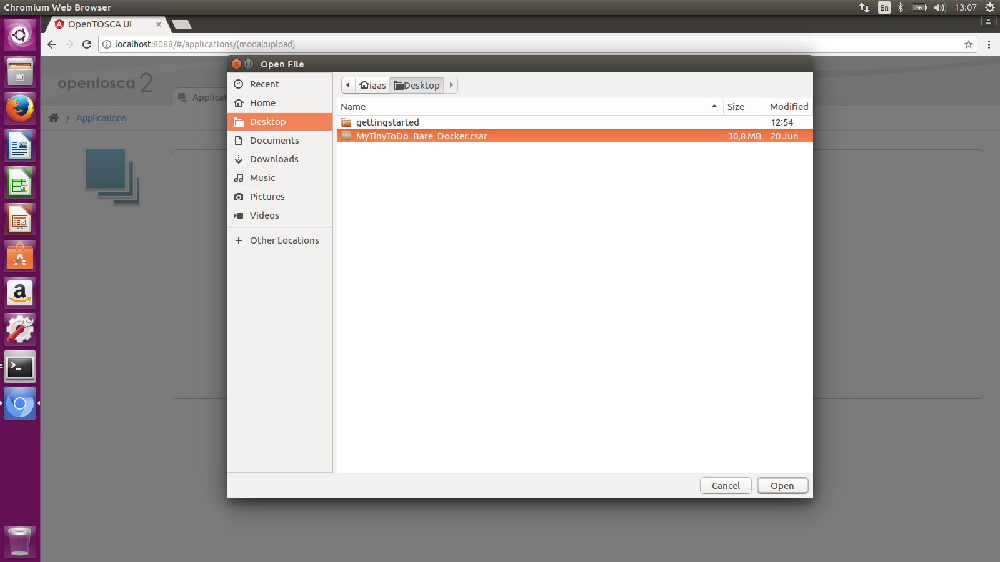

- Confirm the upload

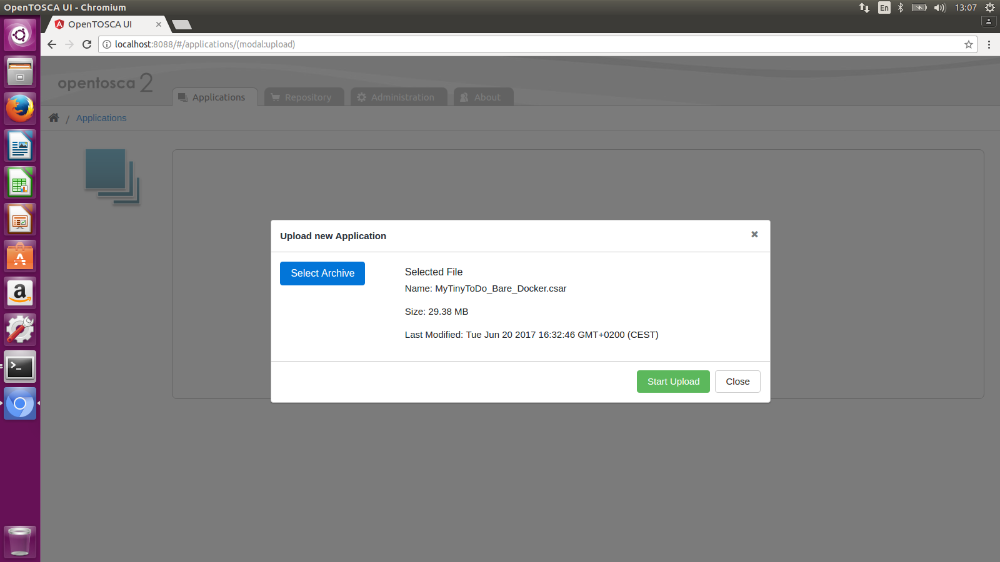

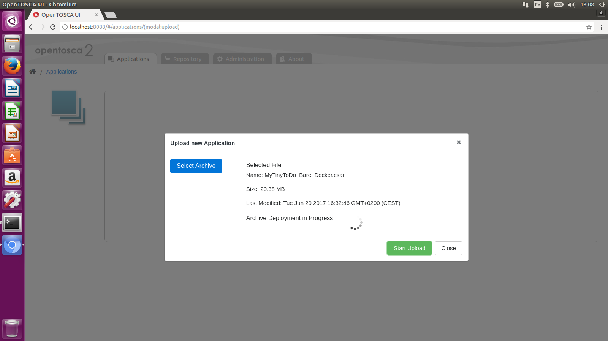

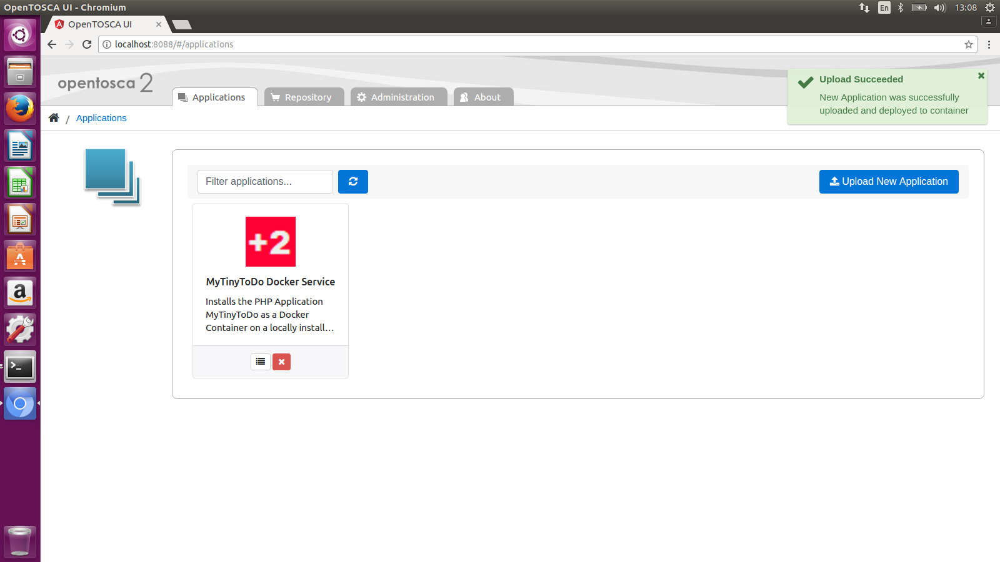

- The left icon is for **showing details**

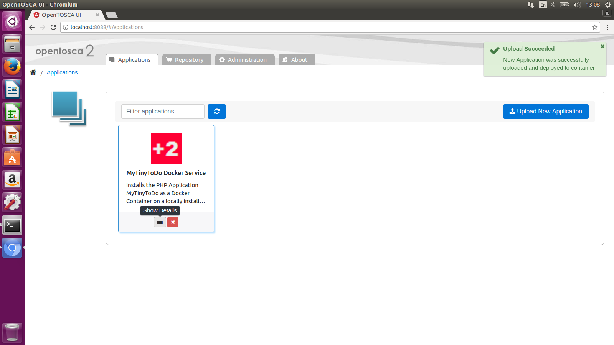

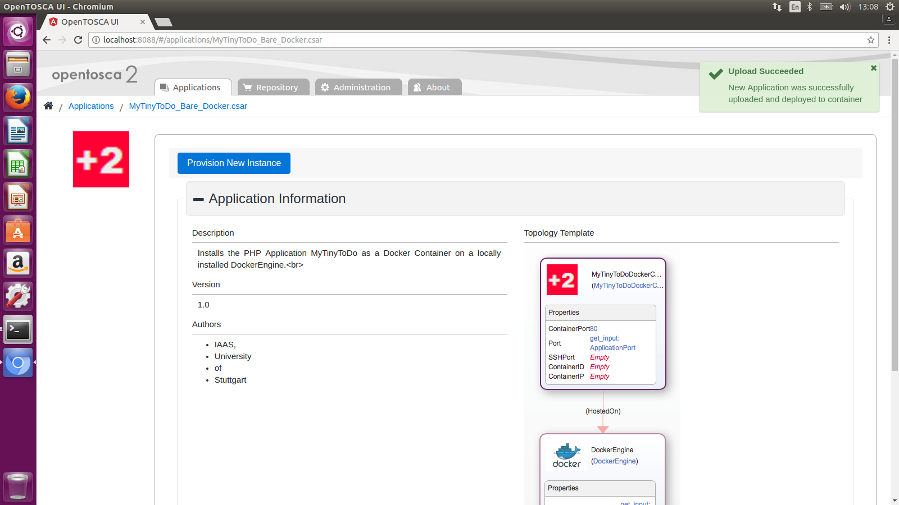

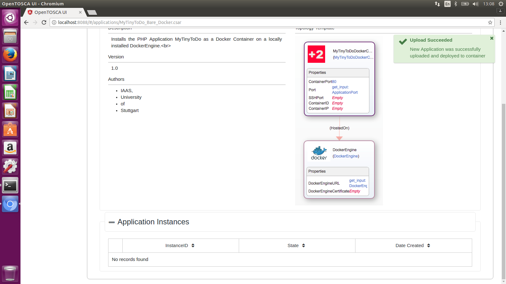

- Enter for the **ApplicationPort: 9990** and
- for **DockerEngineURL: tcp://localhost:2375**

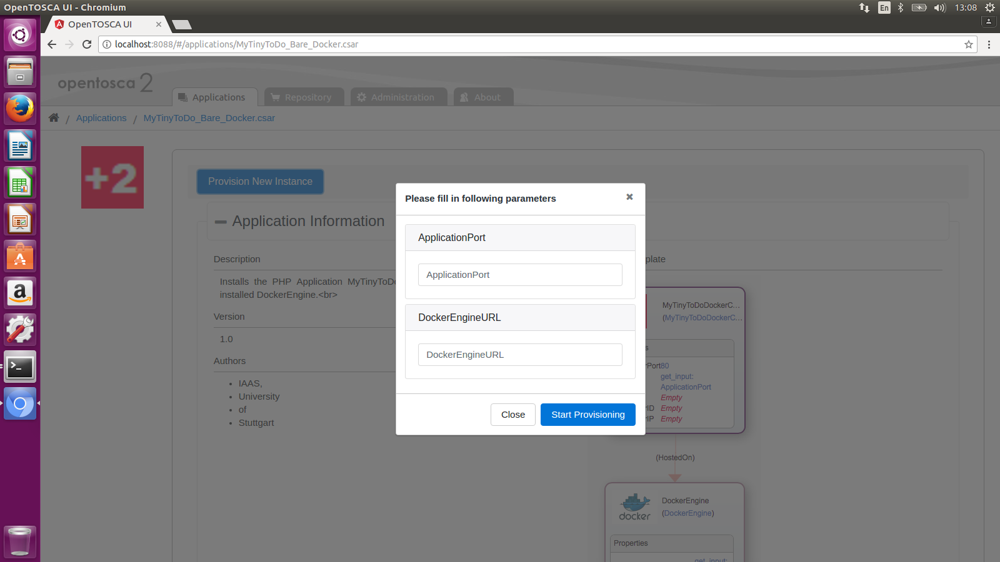

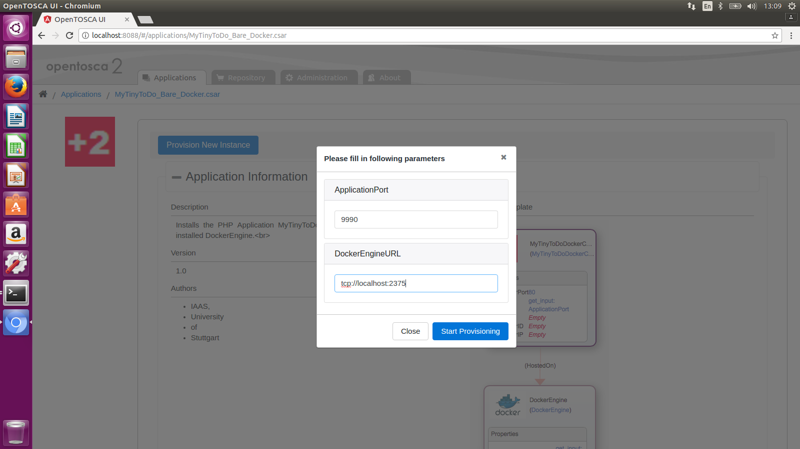

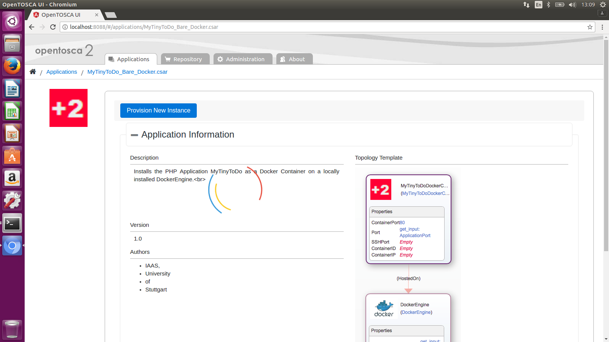

- Click on **Open Application**

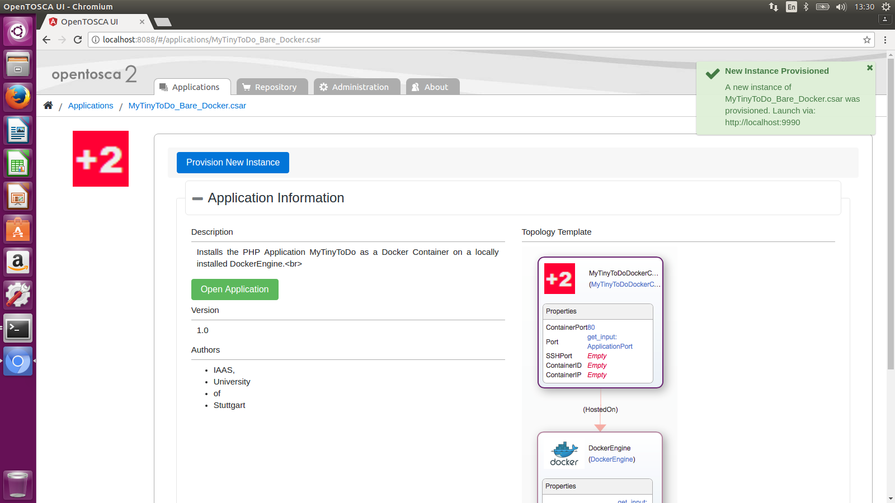

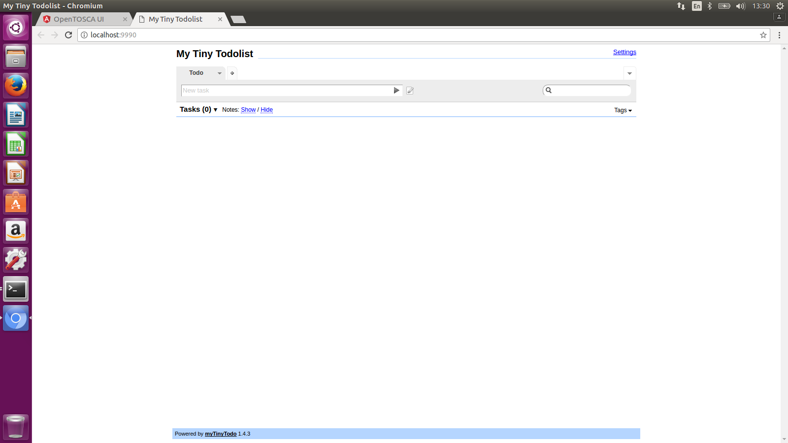

- Create a **Task**

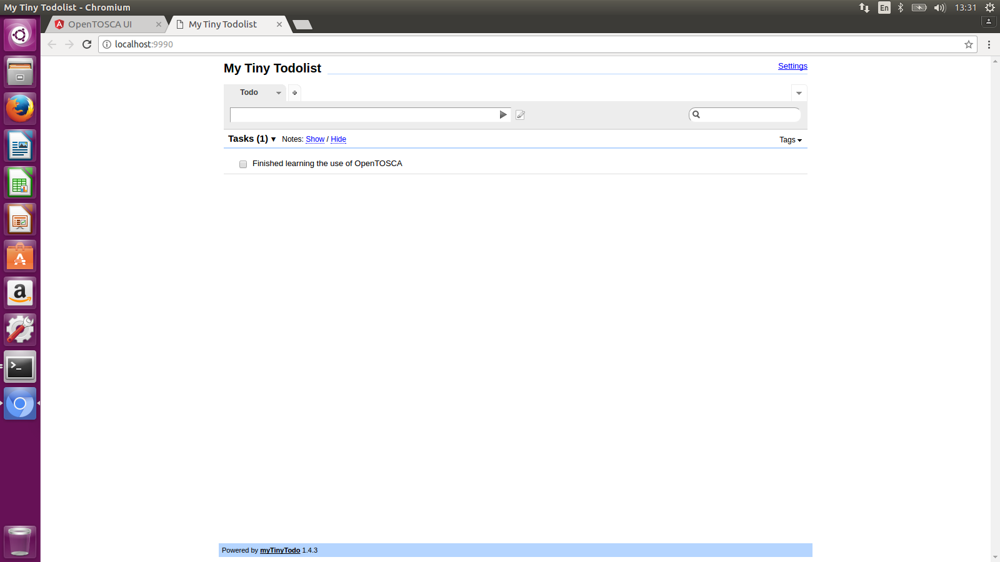

- An instance is created in the **Application Instances** 

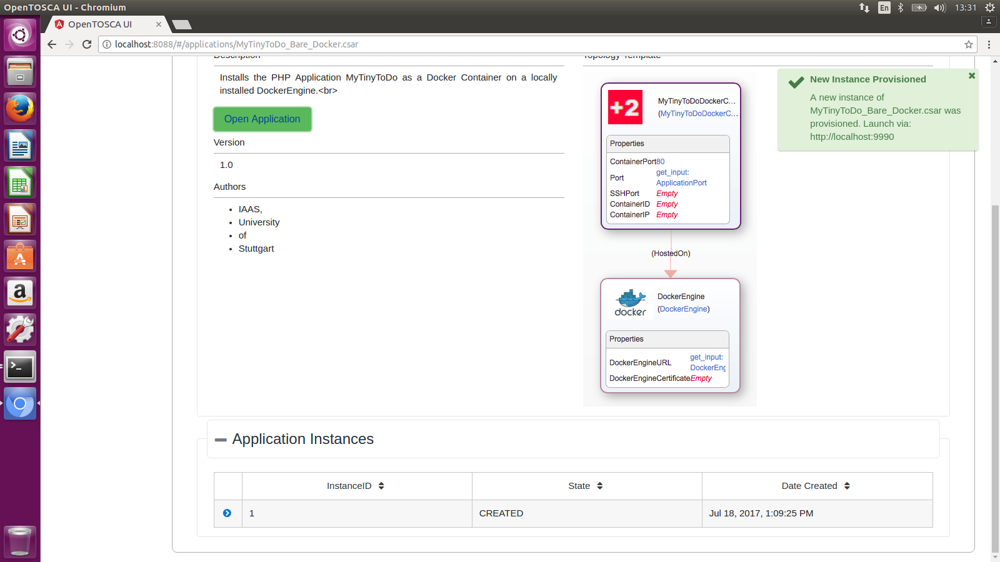
